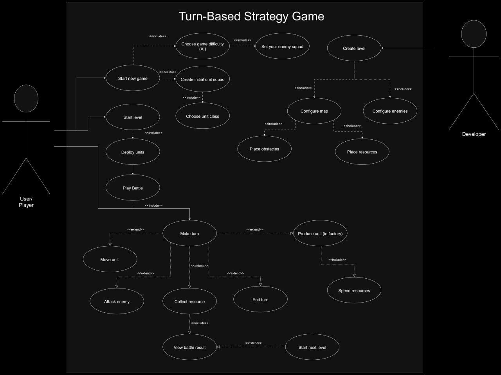

# strategy-game-opp

Навчальний проєкт з дисципліни «Об'єктно-орієнтоване програмування» (Покрокова стратегія).

## Команда та розподіл модулів
* **Андрій Скляренко** — Модуль «ЮНІТИ»: система бою, класи юнітів, фабрики створення бійців.
* **Олег Липчанський** — Модуль «КАРТА»: розмітка поля, перешкоди, генерація ресурсів.
* **Тимофій Кравець** — Модуль «ШІ»: поведінка комп'ютерного опонента (бот).

## Технології
* Мова: Python 3.x
* Парадигма: ООП

## Робота з гілками (Правила команди)
* Головна гілка `main` — стабільна версія проєкту.
* Кожен модуль пишеться в окремій гілці (`feature/units`, `feature/map`, `feature/ai`).
* Злиття в `main` виконується виключно через Pull Request після перевірки.

## Схема прецедентів (Use Case)

